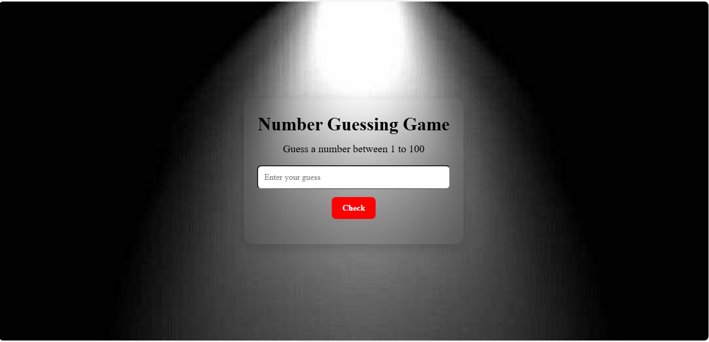

# Number Guessing Game

A simple and fun **Number Guessing Game** built using **HTML, CSS, and JavaScript**.  
The computer generates a random number between 1 and 100, and the player has to guess it.  
The UI includes helpful hints such as **Too High**, **Too Low**, and a **Restart** option.

---

## ✨ Features

- Random number generated automatically on each game start.
- Validates user input (1–100).
- Shows helpful hints:  
  - Too High  
  - Too Low  
  - Correct Guess  
- Displays success message with emoji.
- Restart button to play again.
- Fully responsive design using:
  - `vh`, `vw`, `%`, `rem`
  - Media queries
  - Glass-morphism effect

---

## 🛠️ Tech Stack

- **HTML5**
- **CSS3**
- **JavaScript (ES6)**

---

## 🚀 How to Play

1. Enter a number between **1 and 100**.
2. Click **Check**.
3. You’ll get feedback:
   - "Too low! Try again"
   - "Too high! Try again"
   - "Congratulations! You Win"
4. After winning, click **Restart** to play again.

---

## 🧠 JavaScript Logic

### Generate Random Number
```js
let randomNum = Math.floor(Math.random() * 100) + 1;

```

---

## How to Run the Project

1. Download or clone the repository
2. Open the folder
3. Simply open **index.html** in any browser
4. No installation or server required

---

## Live Preview

(https://number-guessing-game-proj.netlify.app/)

---

## 📸 Screenshot



---


## Author

Developed by **Ayesha Noor**.
Feel free to use, improve, or customize this project.

---

## License

This project is open-source and free to use for learning and practice.

---

If you like this project, consider giving the repo a ⭐ on GitHub!


